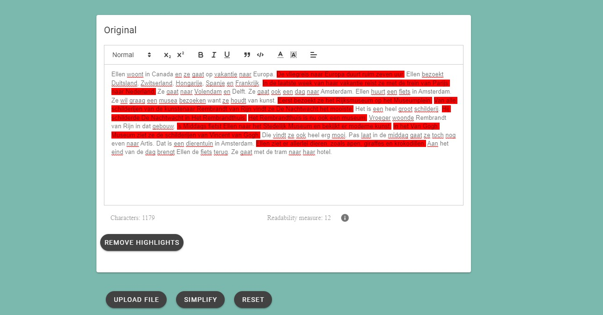

# ARTIST: ARTificial Intelligence for Text Simplification 🎨

## Description 📄
This is an application that implements some existing Machine Learning model to simplify texts as well as visualizes and explains the imposed simplifications in a clear manner. The user is able to accept or alter the changes manually and export the final result. In order to validate the correctness of the process, different readability metrics of both the original and final text are calculated and shown.
This tool accepts as input files in the following formats:
- .epub
- .txt
- .docx/.doc
- .pdf (without images, OCR is not implemented).

## Installation 🚀
### Backend
To install all the requiments

```
pip install -r requirements.txt
```

install django rest framework

```
pip install django_rest_framework
```

Then run the following command to start the server:

```
python manage.py runserver
```

If you want to export the database to a .txt file you can use the following command:

```
python manage.py exportDB
```

NOTE:
When using libraries that have not been added to the project yet, remember to add them inside the requirements.txt file and also
specify the version that has been used.

### Frontend

#### Project setup
```
npm install
```
#### Before COMMITING YOUR WORK
```
eslint --fix 
or yarn lint eslint --fix
or can be configured on vscode by pressing alt + shift + f and selecting 'prettier'
```

#### Compiles and hot-reloads for development
```
npm run serve
```

#### Compiles and minifies for production
```
npm run build
```

#### Lints and fixes files
```
npm run lint
```

#### Customize configuration
See [Configuration Reference](https://cli.vuejs.org/config/).

## Visuals 🌠
The current state of the UI is the following:


The advanced options menu looks like this:


Highlighting by the user will look as follows:


The returned difficult sentences will appear as so:


## Usage 👩‍💻

### Understanding the tool
In the left text area you can either paste or write raw text or upload a file for the tool to extract the text.

After the `Simplify` button is hit, in the text area on the right, the simplified version of the text will become available. This text is also editable.

For both texts, readability metrics are offered. The default can be changed by accessing the `settings` in the upper right corner.

### How to interpret the readability measures
After the text you uploaded has been simplified, you can choose what readability metrics you would like to see.
At the moment, you have to option to select from:
- Flesch Kincaid
- Flesch Duoma
- KPC
- SMOG.

For each of this metric you can select wether you would like to see the <code>minimum age</code> or a percentage.
The <code> minimum age</code> represents the minimum age a reader needs to have in order to completely understand the text. A smaller minimum age for the simplified text indicates a successful simplification.

You have the option to display the difficult sentences by selecting the Spache metric. This will highlight in the original text, all the sentences that have been found as difficult.

## Contributing 🐱‍💻
Feel free to contribute to this project after obtaining approval of the client.
A first good step would be to read the other README files. They contain much detailed information.

## Future ideas 💡
- Add OCR 
- Conduct more thorough research as to how to identify difficult sentences in a text

## Acknowledgments 👏
We would like to thank Cosming Anton, Pratham Johari, Marilotte Koning, Daniël Poolman, Kostas Stefanopoulos, and Beatrice Vizuroiu for helping us build the prototype for ARTIST.
This work was partially supported by the TU Delft [Design@Scale AI Lab](https://www.tudelft.nl/ai/design-at-scale-lab).
In our project, we made use of the Dutch national e-infrastructure with the support of the SURF Cooperative using grant no. EINF-3132.